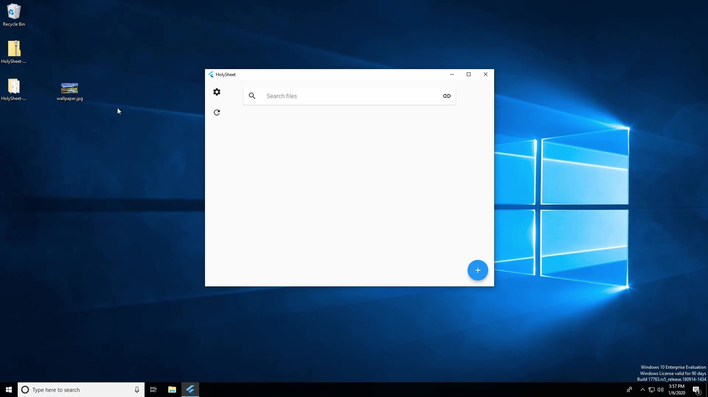
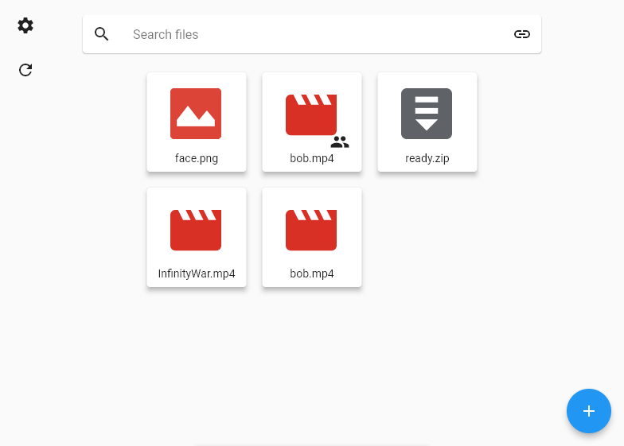
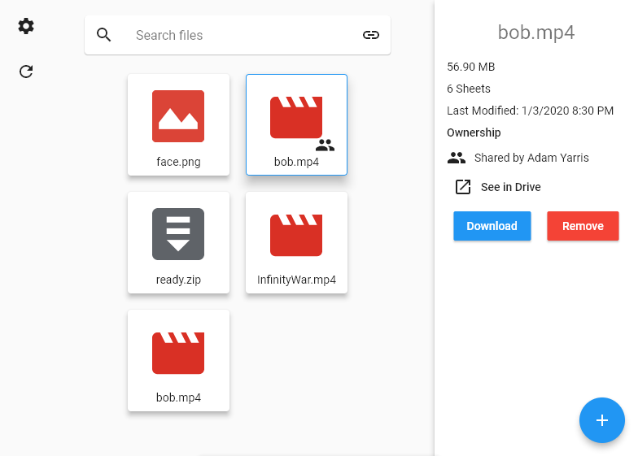
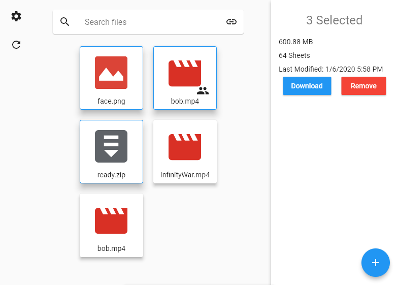
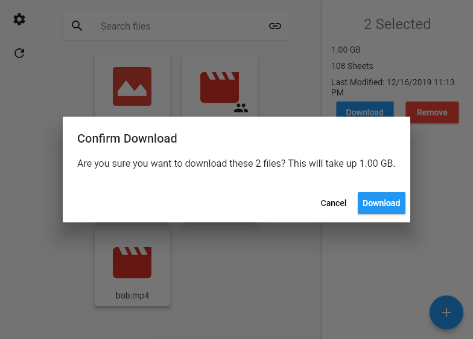
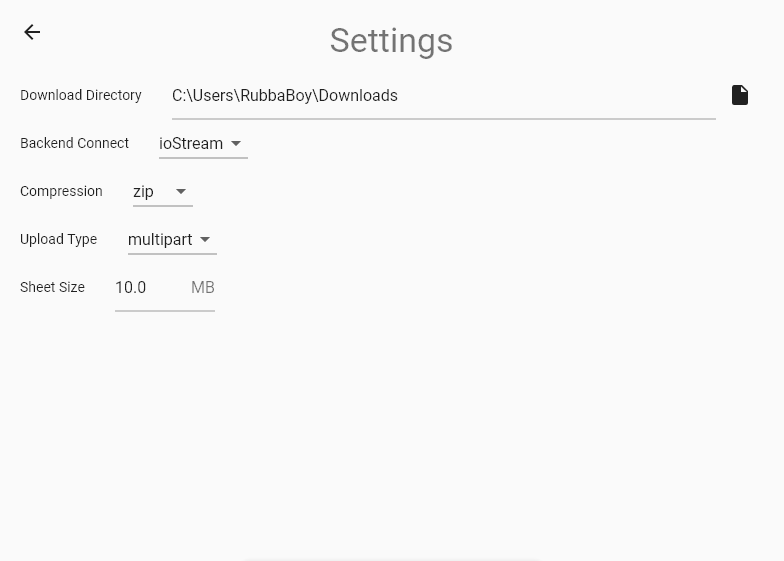

# SheetyGUI

SheetyGUI is a desktop application for HolySheet, a program to store arbitrary files to Google Sheets. This is made in Flutter, and is interfaced to the Java program via sockets.

## Installation

SheetyGUI uses Flutter Desktop Embedding, which is currently not labeled as production-ready. It is usable, however performance will not be the best, and it is not a single executable. There is an installation/demo video below, with steps for installation below.

1. Download the [latest release](https://github.com/RubbaBoy/SheetyGUI/releases/latest) and unzip it
2. Enable the [Google Drive API](https://developers.google.com/drive/api/v3/quickstart/java) and [Sheets API](https://developers.google.com/sheets/api/quickstart/java)
3. Download the client configuration as `credentials.json` into the uncompressed folder
4. Run the executable and authenticate with google

### Demo Video

https://youtu.be/W3wyBj26rsg

## Screenshots

Below are some screenshots of the application in use.

